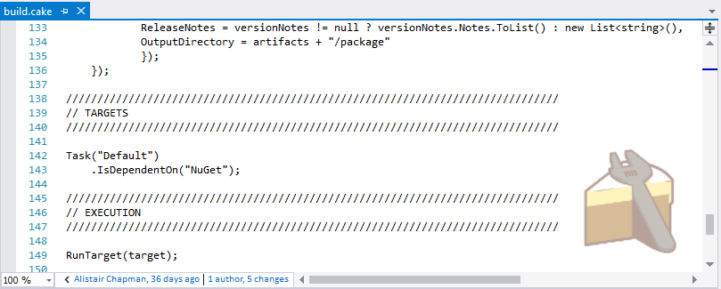
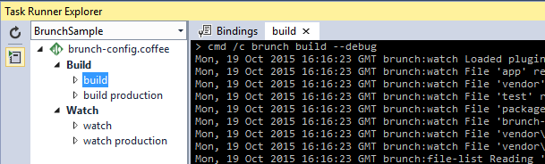
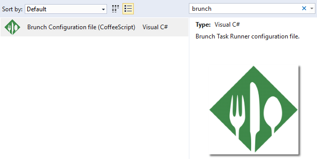

# Cake Task Runner extension
Adds support for the [Cake](http://cakebuild.net/)
build tool in Visual Studio 2015's Task Runner Explorer.

Based off Mads Kristensen's excellent [Brunch Task Runner](https://github.com/madskristensen/BrunchTaskRunner) extension.

## Install Cake
In order to use this extension, you must have
[Cake](https://cakebuild.net/) installed on your machine.

Use [chocolatey](http://chocolatey.org/) to install it globally by
typing the following in a command line:

>cinst -y cake.portable

## Config files
The Brunch Task Runner automatically triggers when it finds
a `build.cake` file. 

This Cake script will have a Cake logo watermark at
the bottom right corner of the editor window.

You can toggle the visibility of the watermark by clicking
on it.

## Task Runner Explorer
Open Task Runner Explorer by right-clicking the Cake script and select **Task Runner Explorer** from
the context menu:

Task Runner Explorer will show both _build_ and _watch_
tasks as well as any _override files_ present in the working
directory.

In this case, there are two *override files*:

1. config.overrides.**staging**
1. config.overrides.**test**

Each task can be executed by double-clicking the task.

### Debugging
By clicking the _Debug_ icon on the left menu bar, the
**--debug** switch is being enabled for all Brunch tasks.

The _Debug_ menu icon is a toggle button that can be left
on or off for as long as needed.

### Bindings
Task bindings make it possible to associate individual tasks
with Visual Studio events such as _Project Open_ etc.

## Item Template
You can easily add a new **brunch-config.coffee** file to
your project from the _Add New Item_ dialog.

Just search for "brunch".

## Contribute
Check out the [contribution guidelines](.github/CONTRIBUTING.md)
if you want to contribute to this project.

For cloning and building this project yourself, make sure 
to install the
[Extensibility Tools 2015](https://visualstudiogallery.msdn.microsoft.com/ab39a092-1343-46e2-b0f1-6a3f91155aa6)
extension for Visual Studio which enables some features
used by this project.

## License
[Apache 2.0](LICENSE) 