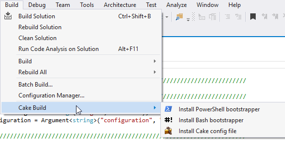

# Cake Task Runner extension
Adds support for the [Cake](http://cakebuild.net/)
build tool in Visual Studio 2015's Task Runner Explorer.

Based off Mads Kristensen's [Brunch Task Runner](https://github.com/madskristensen/BrunchTaskRunner) extension.

## Install Cake
In order to use this extension, you must have
[Cake](https://cakebuild.net/) installed on your machine.

Use [chocolatey](http://chocolatey.org/) to install it globally by
typing the following in an elevated command prompt:

>choco install -y cake.portable

## Build scripts
The Cake Task Runner automatically triggers when it finds
a `build.cake` file. 

## Task Runner Explorer
Open Task Runner Explorer by right-clicking the Cake script and select **Task Runner Explorer** from
the context menu:

Individual tasks will be listed in the task list on the left.

Each task can be executed by double-clicking the task.

### Bindings
Task bindings make it possible to associate individual tasks
with Visual Studio events such as _Project Open_ etc.

## Template Installers
Choose Cake Build from the Build menu to quickly install the default bootstrapper scripts or Cake configuration files into your solution.

## Cake installation
The runner will automatically use a project-local copy of Cake if it is already present 
in the current directory or one of the default paths. 
However, at this time, it will not automatically download Cake for you.

## Contribute
Check out the [Cake contribution guidelines](https://http://cakebuild.net/docs/contributing/guidelines)
if you want to contribute to this project.

For cloning and building this project yourself, make sure 
to install the
[Extensibility Tools 2015](https://visualstudiogallery.msdn.microsoft.com/ab39a092-1343-46e2-b0f1-6a3f91155aa6)
extension for Visual Studio which enables some features
used by this project.

## License
[MIT Licence](LICENSE) 
