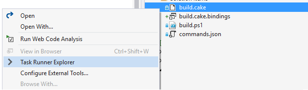
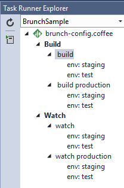
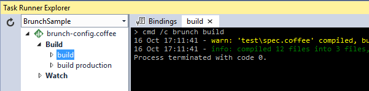
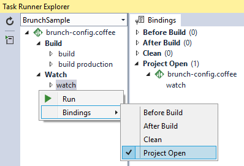

## Brunch Task Runner extension
Adds support for the [Brunch](http://brunch.io/)
build tool in Visual Studio 2015's Task Runner Explorer.

Download the extension at the
[VS Gallery](https://visualstudiogallery.msdn.microsoft.com/de706ad0-8a73-4df3-bef5-867bb9a70d51)
or get the
[nightly build](http://vsixgallery.com/extension/b4a4ad37-5a4b-4dfd-85fd-595cab6a26a9/)

### Install Brunch
In order to use this extension, you must have
[Brunch](http://brunch.io/) installed globally or locally
in your project.

Use [npm](http://npmjs.org/) to install it globally by
typing the following in a command line:

>npm install brunch -g

### Config files
The Brunch Task Runner automatically triggers when it finds
Brunch configuration files. These file names are supported:

1. config.coffee
2. brunch-config.coffee
3. brunch-config.js

### Task Runner Explorer
Open Task Runner Explorer by right-clicking the Brunch
configuration file and select **Task Runner Explorer** from
the context menu:

Task Runner Explorer will show both _build_ and _watch_
tasks as well as any _override files_ present in the working
directory.

In this case, there are two *override files*:

1. config.overrides.**staging**
1. config.overrides.**test**

Each task can be executed by double-clicking the task.

### Bindings
Task bindings make it possible to associate individual tasks
with Visual Studio events such as _Project Open_ etc.

